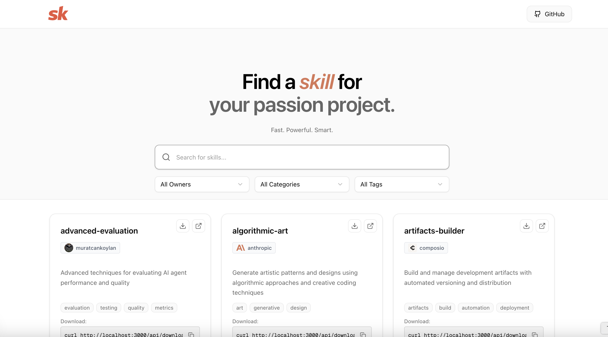

  
   
  <small>Browse, search and download AI agent skills</small>
   
  <a href="https://openskills.space">https://openskills.space</a>

<!-- 
<h2 align="center">Sponsors</h3>

  <a href="https://github.com/sponsors/onurkanbakirci">Be my sponsor and your logo will be here!</a>

-->

---

Welcome to the **Agent Skills Project**! This is a modern web application for browsing, searching, and downloading AI agent skills from various sources including Anthropic, Notion, Composio, and many other contributors from the community.

In this repository, you will find a curated collection of AI agent skills organized by categories, with a clean and intuitive interface for exploring and downloading them.

---

## 🔗 Related Tools

### Skills Gateway

**[skills-gateway](https://github.com/onurkanbakirci/skills-gateway/)** - An intelligent skill selection system that reduces token consumption by 95%. Instead of loading all available skills into your AI context, the Skills Gateway API helps you find and load only the most relevant skill for your task, reducing token usage from ~125,000 to ~1,450 tokens.

Perfect companion to this skills browser - use the gateway API to programmatically select the right skill for any task!

---

## 🤝 Contributing

Contributions are welcome! Feel free to:

- Report bugs
- Suggest new features
- Submit pull requests
- Add new skills
